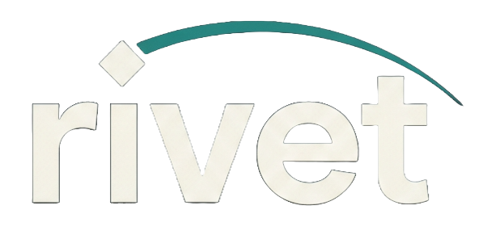
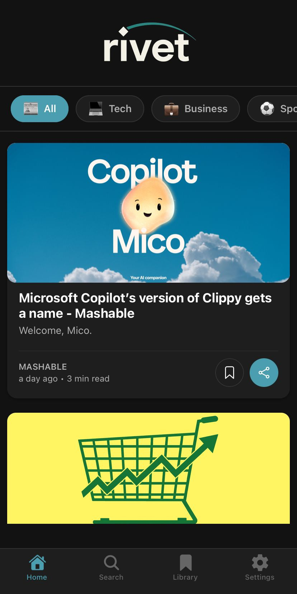
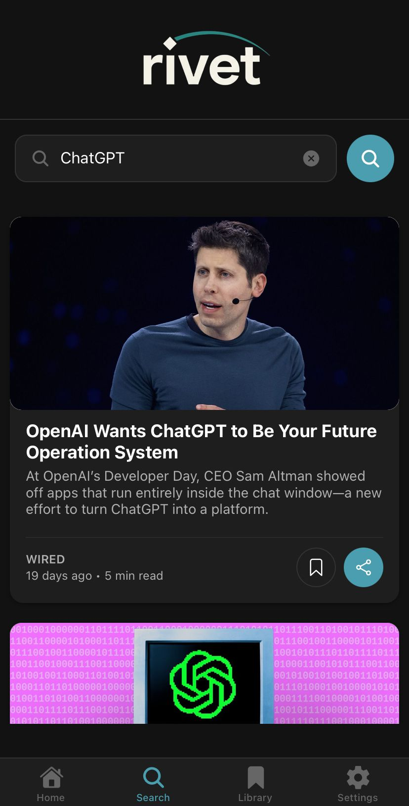
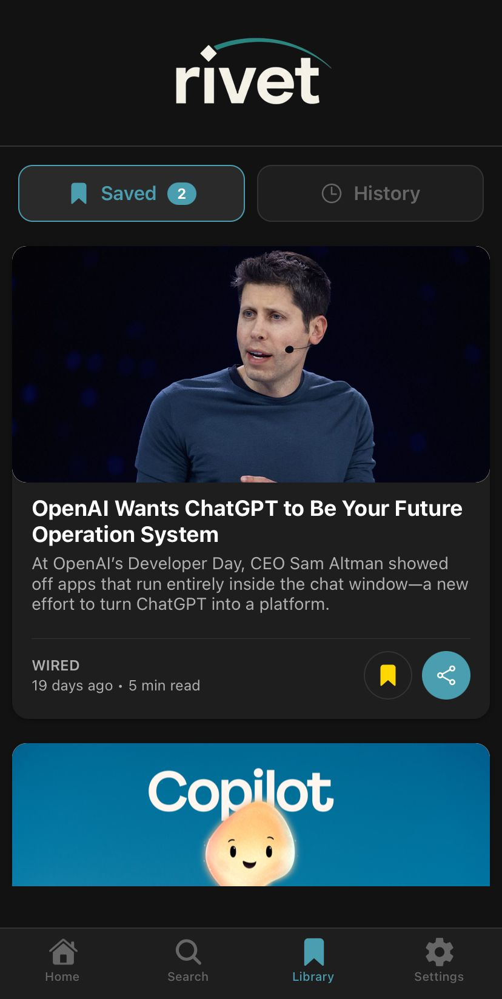
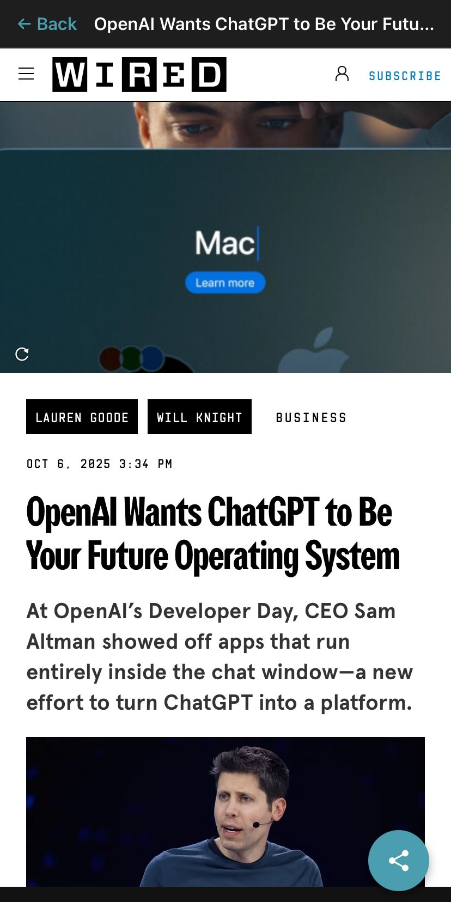
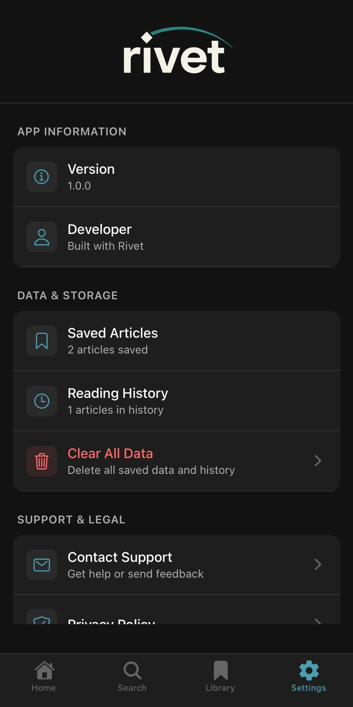

  
  
  # 📰 Rivet News
  
  **Intelligent News Aggregation for the Modern Reader**
  
  
  
  
  
  
  [Features](#features) • [Screenshots](#screenshots) • [Installation](#installation) • [Tech Stack](#tech-stack) • [Contributing](#contributing)
  

---

## 🌟 Features

- **📱 Real-time News** - Fetches latest headlines from multiple sources via NewsAPI
- **🔍 Smart Search** - Search articles with history tracking
- **📚 Library Management** - Save articles for later & track reading history
- **🎨 Beautiful UI** - Dark theme with smooth animations
- **📂 Category Filtering** - Browse by Tech, Business, Sports, Science, Health, Entertainment
- **⏱️ Reading Time Estimates** - Know how long articles take to read
- **📤 Share Functionality** - Share articles across platforms
- **💾 Offline Storage** - Persistent saved articles using AsyncStorage
- **🌐 In-App Browser** - Read articles without leaving the app

---

## 📸 Screenshots

  
  
  

  
  

---

## 🚀 Installation

### Prerequisites

- Node.js >= 18
- npm or yarn
- Expo CLI
- iOS Simulator (Mac) or Android Emulator

### Setup

1. **Clone the repository**
git clone https://github.com/bilxl-irfan/rivet-news-app.git
cd rivet-news-app

2. **Install dependencies**
npm install

3. **Get NewsAPI Key**
- Sign up at [NewsAPI.org](https://newsapi.org/)
- Get your free API key

4. **Configure API Key**
- Open `src/news.ts`
- Replace `YOUR_API_KEY_HERE` with your actual API key

5. **Run the app**
npx expo start

6. **Launch**
- Press `i` for iOS simulator
- Press `a` for Android emulator
- Scan QR code with Expo Go app on your phone

---

## 🛠️ Tech Stack

### **Frontend**
- **React Native** - Cross-platform mobile framework
- **Expo** - Development platform
- **TypeScript** - Type-safe JavaScript
- **Expo Router** - File-based navigation

### **State Management**
- **React Context API** - Global state management
- **AsyncStorage** - Local data persistence

### **UI/UX**
- **React Native Paper** - Material Design components
- **Expo Vector Icons** - Iconography
- **React Native Animated** - Smooth animations
- **WebView** - In-app article viewing

### **APIs**
- **NewsAPI** - Real-time news data
- **Moment.js** - Date/time formatting

---

## 📱 App Structure
rivet-news-app/
├── app/
│ ├── (tabs)/ # Tab navigation screens
│ │ ├── index.tsx # Home screen
│ │ ├── search.tsx # Search screen
│ │ ├── library.tsx # Saved & History
│ │ └── settings.tsx # Settings
│ ├── article.tsx # Article viewer
│ ├── contact.tsx # Contact form
│ └── _layout.tsx # Root layout
├── src/
│ ├── components/ # Reusable components
│ │ ├── Article.tsx
│ │ ├── CategoryFilter.tsx
│ │ └── LoadingScreen.tsx
│ ├── context/ # Context providers
│ │ └── StorageContext.tsx
│ └── news.ts # NewsAPI integration
├── assets/ # Images, fonts, etc.
└── app.json # Expo configuration

---

## 🎯 Roadmap

- [ ] Push notifications for breaking news
- [ ] Dark/Light mode toggle
- [ ] Multiple language support
- [ ] Offline reading mode
- [ ] Article recommendations based on reading history
- [ ] Social media integration
- [ ] Comments & discussions

---

## 🤝 Contributing

Contributions are welcome! Please follow these steps:

1. Fork the repository
2. Create your feature branch (`git checkout -b feature/AmazingFeature`)
3. Commit your changes (`git commit -m 'Add some AmazingFeature'`)
4. Push to the branch (`git push origin feature/AmazingFeature`)
5. Open a Pull Request

---

## 📄 License

This project is licensed under the MIT License - see the [LICENSE](LICENSE) file for details.

---

## 👨‍💻 Author

**Bilal Irfan**

- GitHub: [@bilxl-irfan](https://github.com/bilxl-irfan)
- LinkedIn: [LinkedIn](https://www.linkedin.com/in/bilal-irfan-575583233/)

---

## 🙏 Acknowledgments

- [NewsAPI](https://newsapi.org/) - News data provider
- [Expo](https://expo.dev/) - Development platform
- [React Native Community](https://reactnative.dev/) - Amazing documentation

---

  
  Made by Bilal Irfan
  
  **⭐ Star this repo if you found it helpful!**
  

